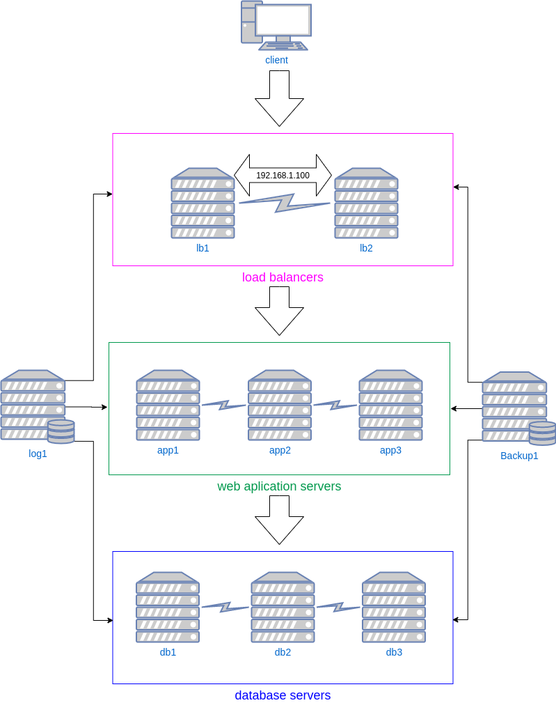

# **Webcluster project**

## Запуск стенда

```
vagrant up
```
либо если возникают проблемы во время провижининга
```
vagrant up --no-provision
vagrant provision
```
wordpress - http://192.168.1.100 

---
***Схема стенда***



---

## Общее описание

- на всех вирутальных машинах используется `centos8`
- на всех вирутальных машинах по умолчанию используется `python3`
- на всех вирутальных машинах настроен `firewalld`

---

## Load balancers

- c помощью `keepalived` настроен `virtual ip` между балансерами (192.168.1.100)
- установлен `haproxy` и настроен для балансировки трафика между web серверами app1, app2, app3.
- web интерфейс haproxy: 
    * http://192.168.1.31:8080/stats
    * http://192.168.1.32:8080/stats
- user: `stat`, password: `statpass`
- установлен filebeat для отправки логов на  сервер log1

---

## Web application servers

- `nginx`
- `php-fpm`
- `wordpress`
- percona `proxysql` для соединения с `pxc cluster db`
- `glusterfs` между серверами настроен для /var/www/html - для синхронизации веб приложений
- установлен filebeat для отправки логов на сервер log1

---

## DB servers

- `pxc cluster`
- скрипты для backup базы данных с помощью `xtrabackup` размещены в домашней директории пользователя `root`
- установлен filebeat для отправки логов на  сервер log1

---

## Backup server

- на сервере настроен nfs
- раздается папка /backup

---

## Log Server

- установлен `elk` (`kibana`, `logstash`, `elasticsearch`)
- веб интерфейс `kibana` - http://192.168.1.51:5601
